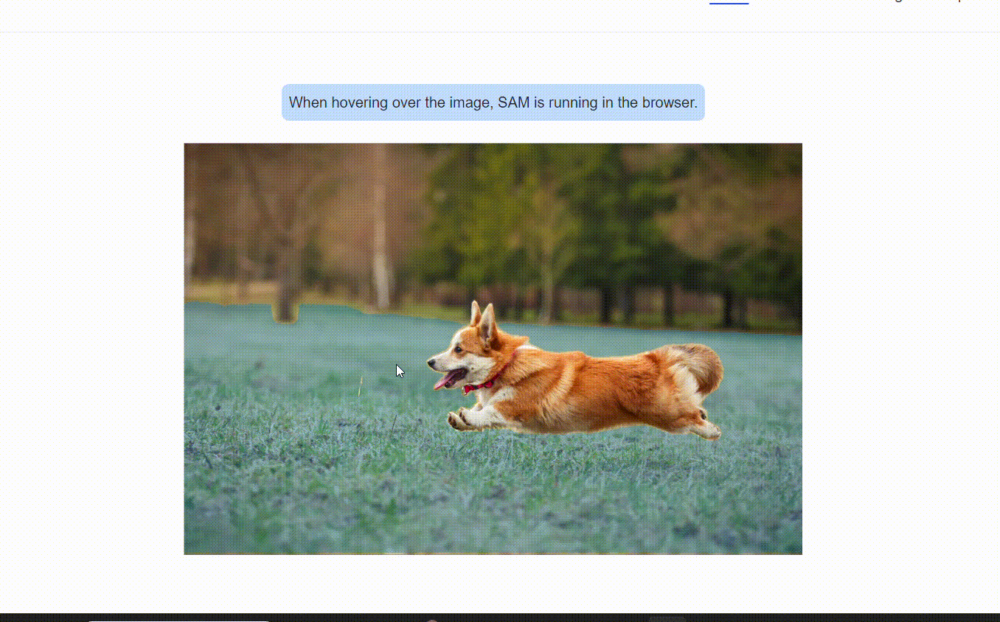

# colabeling

**colabeling** is short for collaborative (image) labeling. This project is a prototype of a system that lets users label objects on images. A common task when preparing datasets for object detection using machine learning. The _colabeling_ aspect refers to the system's ability to support multiple users annotating the same image in real-time. This is achieved through [YJS](https://yjs.dev/), the powerful technology also used in creating collaborative applications like Google Docs. This system also utilizes the [Segment-Anything](https://segment-anything.com/) project by [Meta](https://about.meta.com/) to introduce some automation in the labeling process. This is done through an API which we developed and can be found in [here](https://github.com/loukaspapalazarou/segment-anything-flask-api.git).

## Execution guide

To run the code before reading the rest of the docs follow these steps.

1. Clone the repository

```bash
git clone [https://git.algolysis.com/smart-parts-detector/colabeling.git](https://github.com/loukaspapalazarou/segment-anything-flask-api.git)
cd colabeling
```

2. Install dependencies

```bash
cd backend
npm install
cd ../frontend
npm install
```

3. **(Optional)** Start the SAM API.

Clone the [SAM API](https://github.com/loukaspapalazarou/segment-anything-flask-api.git) repository and follow the instructions inside README.

Make sure that `config.json` points to the correct host for the API.

```
"SAM-API": {
    "HOST": "localhost",
    "PORT": 5000
  }
```

4. Start the websocket server

```bash
cd backend
.\start.bat
```

5. Start the frontend

```bash
cd frontend
npm run dev
```

6. Open 2 or more windows at http://localhost:5173 (default [Vite](https://vitejs.dev/guide/) address) and **enjoy!**


## Project structure

High level outline of the project structure:

```bash
colabeling
├── Image_Labeling_Tools_Comparisson.docx
├── README.md
├── backend
│   ├── dbDir
│   ├── ...
│   ├── start.bat
│   └── start.py
├── config.json
└── frontend
    ├── ...
    ├── src
    └── ...
```

All of the project's configurations, such as image paths, label names and colors, usernames, and more, can be found and edited inside `config.json`. In the future, the backend and frontend should have their own config files, which will be provided by the backend. For now, we have chosen to keep things simple, and the config file is located at the top level of the project directory. Details of this file will be discussed in subsequent sections wherever relevant. The project also contains a document in which we compared various existing image labeling tools in order to understand the landscape of image labeling and whether a tool like ours could benefit the industry.

## SAM API

We used the [SAM API](https://git.algolysis.com/smart-parts-detector/spdml-flask-sam-api) we built to segment the image around a single point, that being the mouse click. Although [SAM](https://segment-anything.com/) has multiple ways to segment images, we chose to keep it simple and use the single point segmentation.



Taken from the official website, we can see how SAM segments the part of the image that the cursor is at.

Our API has many endpoints that control its behavior and masking abilities. Those can be found [here](https://git.algolysis.com/smart-parts-detector/spdml-flask-sam-api/-/blob/main/README.md). As mentioned earlier, the only endpoint we use in this project is `predict`. Here is an example of a cURL request, specifying the target image, as well as the x and y position of the desired segmentation point.

```
curl -X GET -F "image=@images/11847.jpg" "http://localhost:5000/predict?x=186&y=847"
```

And here is an example of `colabeling` using this API.


## Backend

For the users to observe each other and their changes, we used [y-websocket](https://github.com/yjs/y-websocke). A project built on top of websockets for yjs. The websocket can be started from the backend directory with just one command

```bash
npx y-websocket
```

However, this will start the websocket server with default host, port and no persistence. Since we want all of those features, we have to set them as environment variables. We first declare them inside `config.json`.

```
"Y-WEBSOCKET": {
    "HOST": "localhost",
    "PORT": 1234,
    "YPERSISTENCE": "./dbDir"
  }
```

We set the desired host, port and the folder that our bounding boxes will be persisted in. We set the environment variables through a python script like so:

```python
import json
import os

if __name__ == "__main__":
    config_file = "../config.json"

    with open(config_file, "r") as f:
        data = json.load(f)

    HOST = data["Y-WEBSOCKET"]["HOST"]
    PORT = str(data["Y-WEBSOCKET"]["PORT"])
    YPERSISTENCE = data["Y-WEBSOCKET"]["YPERSISTENCE"]

    os.environ["HOST"] = HOST
    os.environ["PORT"] = PORT
    os.environ["YPERSISTENCE"] = YPERSISTENCE

    import subprocess

    subprocess.run(["node", "./node_modules/y-websocket/bin/server.js"])
```

We can now start the websocket server just by running the dedicated batch script

```
.\start.bat
```

If everything worked the output should look like this

```
Persisting documents to "./dbDir"
running at 'localhost' on port 1234
```

## Frontend

The frontend folder is just a [Vite](https://vitejs.dev/guide/) project that acts as the user interface. The frontend takes care of displaying the users, the bounding boxes users are currently drawing as well as the previously drawn bounding boxes. To start the frontend simply do

```
npm run dev
```

Your display name can be changed from `config.json`

```
"USERNAME": "default_username"
```

Start 2 or more instances of frontend using different display names. Visit the addresses displayed on each console in you browser, and **enjoy!**


